# SPELLING BEE

## Introduction

The **Spelling Bee Quiz** is an interactive spelling game designed to help users practice and improve their spelling skills. It challenges players to spell words correctly within a set time, while also providing features like a "50/50" lifeline and difficulty levels.

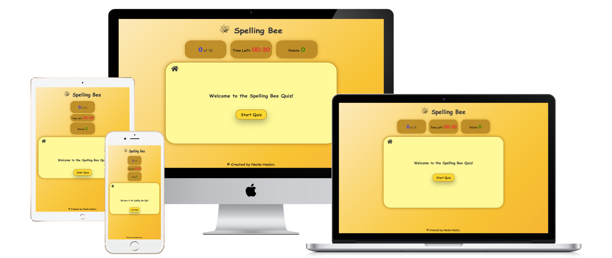

# User Stories

## Visitor Goals

- I want to have fun while improving my spelling skills. 
- I want to interact with buttons, answer choices, and lifelines (like 50/50) in an intuitive and easy way.
- I want clear instructions about how to start, how to use features like 50/50, and how to track my progress in the game.
- I would like to know right away if my answers are correct or incorrect. I want immediate feedback on how they're doing, like sound effects for correct or incorrect answers.
- I want to see my score, progress through the quiz, and time remaining.
- I want to choose my difficulty (easy, medium, hard).
- I want the quiz to gradually increase in difficulty.
- I want the game to look good, with attractive design elements that make it visually appealing. 
- I want the quiz to be responsive on all devices, whether I'm playing on a phone, tablet, or desktop.
- I want to start the game easily, with a button to start the quiz right away and easy navigation to switch between different parts of the game.
- I want to see how many questions I answered correctly and view my total score at the end.

## Site Owner Goals

- I want to provide users with an enjoyable yet challenging way to improve their spelling skills.
- I want to ensure the game is simple, intuitive, and accessible, making it easy for players of all ages to understand and enjoy.
- I want to implement multiple difficulty levels (Easy, Medium, Hard).
- I want to allow users to use a 50/50 lifeline, helping them narrow down their choices.
- I want to keep track of the user’s score and progress throughout the quiz, showing them how many questions they’ve answered correctly and how much time remains.
- I want to introduce a timer that adds a sense of urgency and teaches users to think quickly and efficiently under pressure. 
- At the end of the quiz, I want to provide a certificate with the user’s score to motivate them to play again or improve their performance
- I want to make the game accessible on different devices (desktop, tablet, mobile).
- I want to use sound effects (correct/wrong answers, button clicks).

## Target Audience

- **Age Range**: 12 onwards, with specific interests for younger learners, language enthusiasts, casual players, and educators. 

## Design

### Color Scheme

The color scheme was inspired by the colors of bees, honey, and the hive.

- Body Background: linear-gradient(135deg, #fceabb 0%, #f8b500 100%), which stands for honey-themed background color.
- Game Area Background: A soft yellow (#ffff99) with a honey-like golden border and box-shadow (#B8860B, a dark honey color).
- Main Buttons & Interactive Elements: Golden hues like #FFD700 (honey gold) and #e6b800 (darker golden-yellow) for hover effects.
- The text primarily uses a neutral dark gray (#3a3a3a) and black, with some bright color accents like green (#28a745) for correct answers, and red (#dc3545) for wrong ones.
- Timer, Score, Question Number: These elements have bright colors like red (#ff0000), green (#28a745), and blue (#0000ff) to stand out.
- Popup Background: Gradient of deep purple (#3E2A47) and honey yellow (#F9A602), with golden borders (#B8860B).
- Popup Text: Bold black text against a light-colored background with a pop of yellow or red for interactive buttons.
- Submit and Action Buttons: Similar golden yellow tones with a border of dark honey and box-shadow effects to provide a tactile feel.
- Play Again and Instruction buttons have the green background with the white text.

## Fonts

The font used in my stylesheet for various elements is primarily 'Comic Sans MS', 'Trebuchet MS', and cursive. These fonts are used for various components such as the body, buttons, and game elements and they give the site a playful look.

## Wireframes

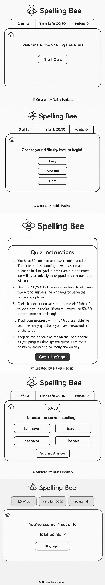

## Features 

- **Difficulty Levels**: The game offers three levels of difficulty: Easy, Medium, and Hard. Players can choose their preferred level at the start of the quiz.
  
- **Timer**: Each question comes with a 30-second countdown timer. If the timer runs out before the user answers, the question will automatically be skipped.

- **50/50 Lifeline**: The "50/50" button can be used once per level to eliminate two incorrect answers, helping users focus on the remaining options.

- **Progress Tracker**: A progress table shows the current question number and the total number of questions, so players can track how far they've gone.

- **Scoreboard**: Players earn points for correct answers. The score is updated dynamically during the game.

- **Certificate**: At the end of the quiz, users receive a certificate with their scores.

### Existing Features

Instead of adding extra pages, modals are utilized to provide a smoother and more intuitive user experience, keeping everything in one place.

#### Welcome page

  - This is the main landing page. It contains the heading, Start Quiz button, the welcome message, Home Button, the copyright and quiz tables (Progress, Timer, Score).
  - The quiz begins with a friendly Welcome Page that greets the user and sets the tone for the game.

  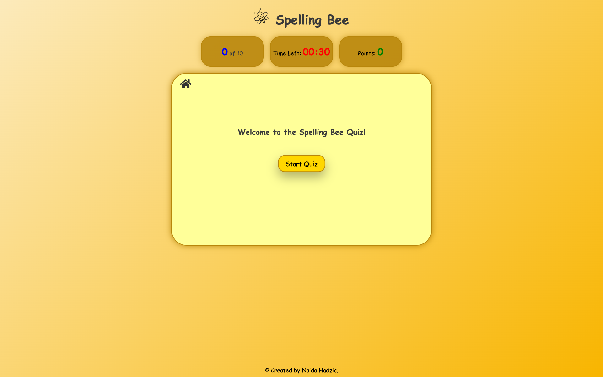

##### Home Button

   - A Home button is included in the quiz interface, allowing users to return to the main screen at any point during the game. 
   - This improves navigation and provides users with an easy way to restart or choose a different difficulty level.

  

##### Heading

  - A prominent heading displaying the quiz title is included at the top of the quiz. This provides a clear and consistent context throughout the game, making it visually appealing.

  

##### Tables 

  - The quiz features a progress tracker that displays the current and total question numbers to help players monitor their progress, along with a dynamically updated scoreboard where players earn points for correct answers. The tables are disabled on the welcome page. They are presented throughtout the quiz.
  The quiz contais ten questions per level. The timer counts down from 30 seconds. 
  

##### Welcome message 

- A friendly and engaging welcome message greets users upon landing on the quiz page. It introduces the game and invites them to begin, setting a positive tone for the quiz experience.

##### Start Quiz Button

- A clearly visible and user-friendly "Start Quiz" button initiates the quiz experience. 
- It becomes active once the user reads the instructions, ensuring they are informed before beginning the game. It changes the color when hovered over. The button zooms in when hovered.

##### Footer

- I included the name of the project founder at the bottom of the page, which remains visible at all times.

#### Difficulty levels modal

  - Beside the Home Button, copyright message and Progress, Timer and Score Tables, it includes the buttons for Easy, Medium and Hard levels, where users can choose the difficulty level before the game starts. Each level contains ten questions, and they are shuffled every time, so the quiz never starts with the same question.
  - There is also a text message providing clear instructions for users to choose their level.
  - The tables are also disabled on the difficulty level modal.
  
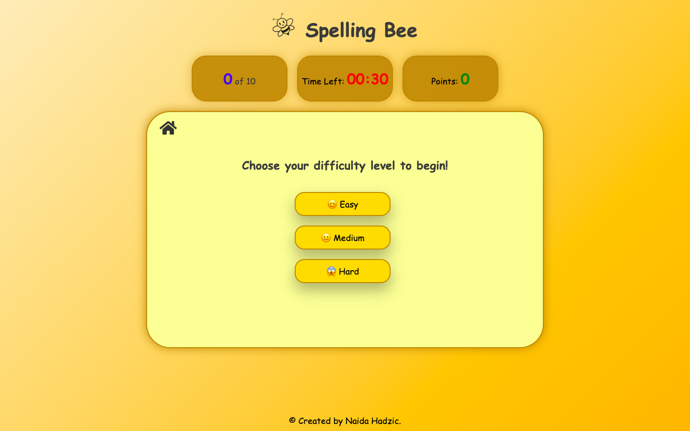

##### Text message 

- The text implies that there are multiple levels of difficulty available, and the user needs to pick up one according to their preference.

##### Difficulty Level Buttons

- There are tree buttons for: Easy, Medium and Hard level.
- The buttons change the color when hovered over.
- The buttons zoom in when hovered.

#### Game Instructions modal

  - The Quiz Instructions section will guide users through the gameplay, ensuring they understand the rules and how to maximize their chances of success:
  - Time Limit: Users will learn that they have 30 seconds to answer each question, and the timer will begin as soon as the question appears. This will help them manage their time efficiently.
  - 50/50 Lifeline: Users will understand that the "50/50" button can be used once per level to eliminate two incorrect answers, giving them a better chance of choosing the right one.
  - Answer Submission: Users will know that after selecting the correct answer, they need to hit the "Submit" button to lock in their choice. They are encouraged to use the 50/50 lifeline before submitting if they are unsure.
  - Progress Tracking: Users will be able to track their performance by seeing how many questions they've answered out of the total, helping them stay focused and motivated throughout the game.
  - Score Tracking: Users will monitor their score as they play, earning points for correct and quick answers, keeping them engaged and motivated.
  - Certificate Reward: At the end of the quiz, users will receive a certificate that highlights their results, providing them with a sense of accomplishment and closure.

This section is designed to ensure users understand how to play the quiz effectively while motivating them to do their best with clear guidance and exciting rewards.

##### Let's go Button

- The modal contains Let's go Button, which leads to quiz questions.
- It confirms that the user understands the instructions and is ready to begin the quiz.

#### Quiz Questions modal

  - The quiz content dynamically displays the current question along with multiple answer options for the user to select from.
  - Users can choose the correct answer from the available options, making the quiz engaging and interactive.

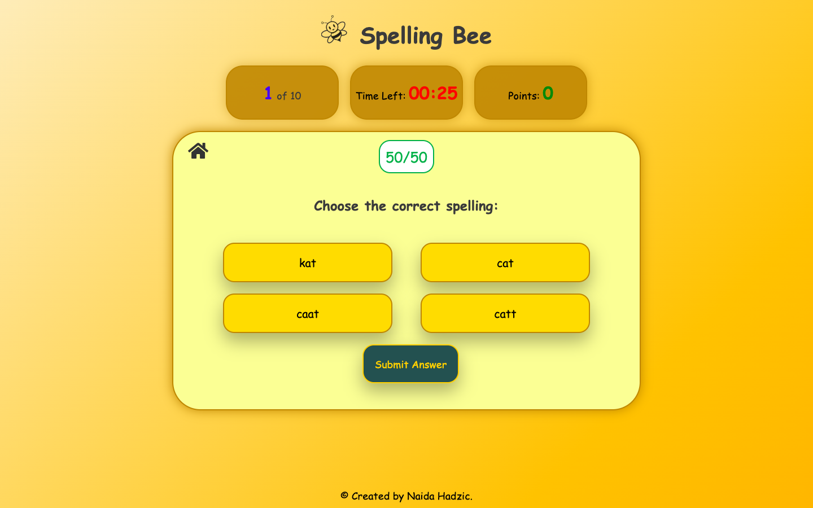 

##### Tables

- This ensures users are aware of the time pressure, their current progress, and their score throughout the quiz.

- **Timer**: A countdown timer is displayed for each question. Users have a limited time to answer (e.g., 30 seconds per question). The timer starts as soon as the question appears and automatically skips the question if time runs out.
- **Question Count**: The quiz tracks and displays the number of questions answered, so users can see their progress throughout the quiz.
- **Scoring Table**: The score is tracked and updated as the user answers each question. Points are awarded based on correct answers, with higher scores given for quicker responses. Users can keep track of their total score as they progress through the game.

- **Submit Button**

- A Submit Answer Button is provided for users to submit their selected answer. This action triggers the validation and moves the quiz forward.
- The Submit Answer Button includes a bounce and hover effect to enhance the user experience. These animations make the interface feel more dynamic and intuitive, encouraging users to interact with confidence.
- - The **Submit** button is disabled when the popup appears.

 

##### Error Popup

- An error popup is shown if the user attempts to submit an answer without selecting one. This ensures users are reminded to make a choice before proceeding.

##### 50/50 Button

- The game includes a "50/50" button that users can use once per level. When activated, it eliminates two incorrect answers, increasing the chances of selecting the correct one. This adds a strategic element to the quiz and supports users who are unsure of the answer.
- It can be used only once per level.

##### Timer Popup

- If the user does not select an answer within 30 seconds, the quiz moves to the next question. Before that, a Timer popup appears, visually displaying all answer options—the correct answer highlighted in green, and the incorrect ones in red. 
- This gives immediate feedback and helps the user learn from their mistakes.
- When a popup appears (e.g., for a correct, incorrect, or time's up message), the timer in the background is automatically paused. This ensures that users are not rushed while reviewing feedback or preparing to move on to the next question.
- When the time runs out, a popup appears to notify the user that the time is up.
- Incorrect answers are highlighted in red, while the correct answer is shown in green for instant feedback.

##### Wrong/Correct Answer Popup

- If the user selects the wrong answer, a popup will appear displaying a "Wrong" message. The selected (incorrect) answer is highlighted in red, while the correct answer is shown in green to provide immediate feedback and help with learning.

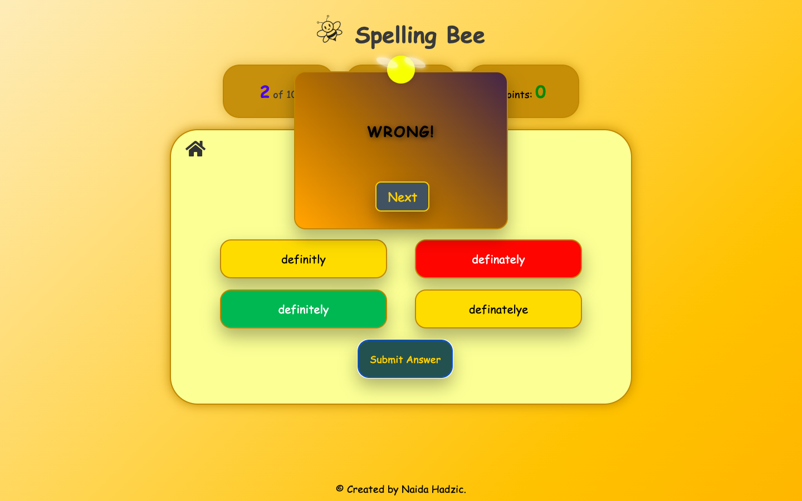

##### Next Button

- After each question—whether answered correctly, incorrectly, or skipped due to time running out—a "Next" button appears in the popup. This allows the user to move forward at their own pace, maintaining control over the quiz flow even when the timer has expired.

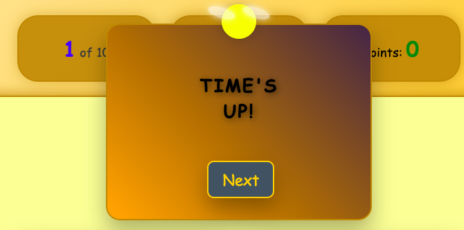

##### Selected Question

- When a user selects an answer, it is highlighted in orange to clearly indicate their current choice before submitting. 
- This improves clarity and enhances user experience by making interactions more intuitive

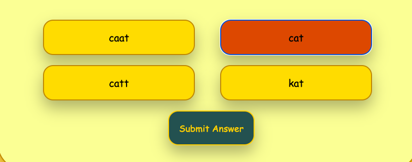

#### The Certificate

  - Upon completing the quiz, players receive a **certificate** summarizing their performance, including the number of correct answers and total points scored.
  - It encourages replayability and helps track improvement over time.

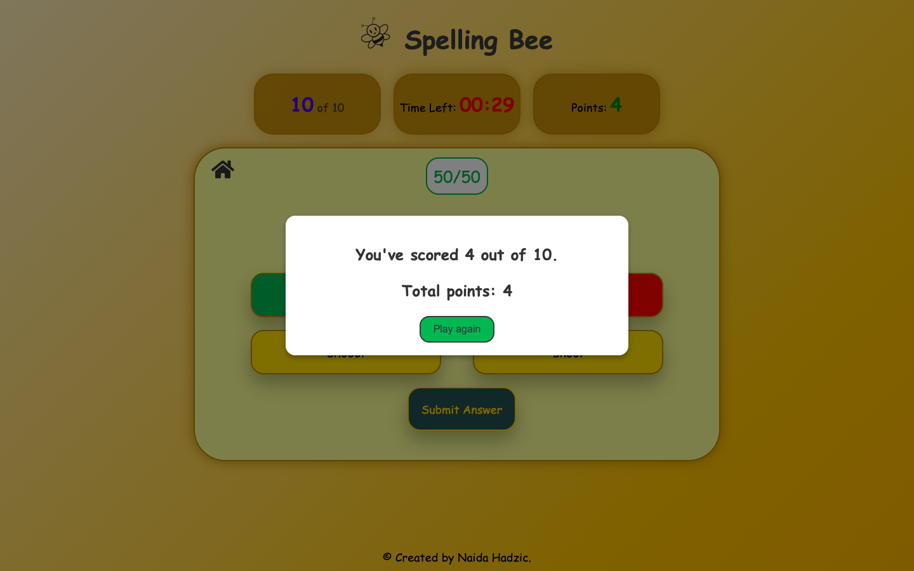

#### Play Again Button

- It allows users to restart the quiz immediately after finishing, encouraging repeated practice and learning without having to refresh or navigate away from the page.
- The button changes its green color to lime green when hovered over.

#### Footer

-The footer is included at the bottom of the game interface and contains a credit line: “Created by Naida,” giving recognition to the project creator.

#### Favicon
- The webpage includes a custom favicon featuring a bee icon and the title “Spelling Bee” displayed in the browser tab, adding a polished and thematic touch to the game.

## Features Left to Implement

- **Daily Challanges**- I would like to introduce daily word challenges to keep players engaged.

- **Multiplayer Mode**- I want to add a competitive mode where users can challenge friends or random players in real time.

- **Custom Word Lists**- I would like to let users or teachers upload their own word lists for personalized quizzes.

- **Rewards and Badges**- I would like to gamify the experience by unlocking badges or rewards based on performance.

- **User Accounts & Progress Tracking**- I would like to enable users to create profiles, save their scores, and track progress over time.

## Testing 

### Validator Testing 

- HTML
  - No errors were returned when passing through the official [W3C validator](https://validator.w3.org/nu/#textarea)

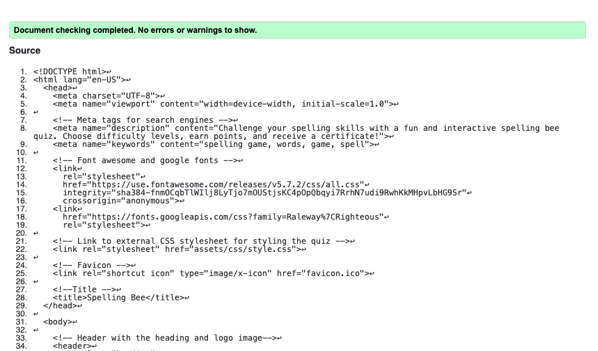

- CSS
  - No errors were found when passing through the official [(Jigsaw) validator](https://jigsaw.w3.org/css-validator/#validate_by_input)

  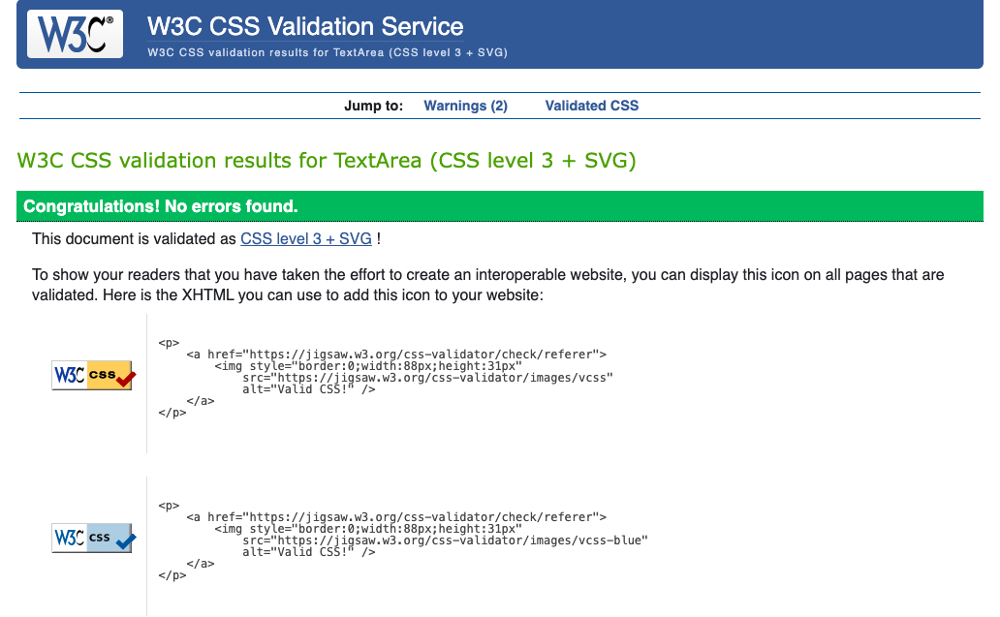

  - Java Script
   - No errors where found when passing through the official [(jshint) validator] 

- Responsively App
   - Used to test how my website looks and behaves on different screen sizes and devices. 

## Functionality testing

This interactive spelling quiz game is designed to test and improve spelling skills across three difficulty levels: Easy, Medium, and Hard. Below is a breakdown of how the game works and what users can expect at each step:

### Game Flow & Rules

**Home Page (Start Screen)**

- The game begins on the Start Quiz page.
- Click the "Start Quiz" button to proceed to difficulty selection.

**Difficulty Selection**

- Choose from Easy, Medium, or Hard.
- Each level has its own set of 10 spelling questions.

Clicking a difficulty:
- Plays a sound.
- Loads the quiz area.
- Displays instructions via the instruction overlay.

**Instruction Overlay**

- Shows up after selecting difficulty.
- Click "Let's go" to begin.

**Quiz Rules**

- Each question has one correct spelling out of four options.
- A 30-second countdown timer starts for every question.
- If time runs out, the correct answer is revealed automatically.

**Answering Questions**

- Click an answer option (button).
- The correct answer will be highlighted in green.
- Incorrect selections will be highlighted in red.
- A popup message will appear: "Correct!" or "Wrong!".
- Score is updated accordingly.

**Submit Button**

- Use this to lock in your selected answer.
- Becomes disabled after each question is answered.

**Next Button**

- Moves the user to the next question.
- Appears after answering.

**50/50 Lifeline**
- Each level offers a single-use 50/50 lifeline.
- Removes two incorrect answers.
- Button becomes disabled and labeled "Used" after activation.

**Timer**

- Displays remaining time in MM:SS format.
- If it reaches 0, the game shows the correct answer and ends the question.

**Game End**

- After answering all questions, a certificate popup congratulates the player.

**Home Button**

- Resets the entire game.
- Takes you back to the start page.
- Resets score, questions, and timer.

**Button Effects**

- All buttons include click sound effects for user feedback, except from Submit Button, which has the hover and bounce for user feedback.
- Hovering over buttons adds a visual effect (e.g. background change or zoom-in) to show interactivity.
- Buttons that are not usable (like 50/50 after use or Submit after answering) are automatically disabled to avoid confusion.

**Zoom-In Effects & Hover Interactions**

- Hover Effects:
Quiz answer options use hover states for better user experience.
Hovering highlights the button to show it’s clickable.
- Zoom-In Animations:
When you hover over interactive elements (e.g. answer buttons, lifeline, start button), they slightly zoom in to draw user attention.
- This animation provides a more dynamic and modern interface feel.

**Responsiveness**

- The quiz layout is fully responsive:
- Works across devices (mobile, tablet, desktop).
- Uses media queries to adjust layout and font sizes.

### Performance 

- Google Lighthouse in Google Chrome Developer Tools was used to test the performance of the website.

### Performing test on various devices

- The website was tested on multiple devices using the browser's inspect tool to emulate different screen sizes and resolutions:
 - iPhone SE
 - iPhone XR
 - iPhone 12 Pro
 - iPhone 14 Pro Max
 - Pixel 7
 - Samsung Galaxy S8+
 - Samsun Galaxy S20 Ultra
 - iPad Mini
 - Surface Duo
 - Galaxy Z Fold 5
 - Samsun Galaxy A51/71
 - Nest Hub Max
 - galaxy fold

 - The responsiveness of the website has been tested on available phones in my surroundings to ensure proper display on different devices:
- iPhone 15 Pro Max
- iPhone 15 Pro 
- Samsung Galaxy A4
- Samsung Galaxy S25 Ultra

### Browser testing

- The website was tested with Chrome, Mozilla, Safari and Edge browsers on both a Mac computer and a Windows computer.

## Bugs

### Fixed bugs

- **The click sound**  wasn't working consistently across all buttons. I added the method **clickSound.play();**, which plays the sound immediately after the click event is triggered, inside the event listener or function where I wanted to play the click sound. I also added (clickSound.currentTime = 0;), which ensured that the sound starts from the beginning every time.

- I encountered an issue where **the countdown timer** continued running even after the popup for wrong and correct answers appeared. To resolve this, I used (clearInterval(timer);) statement to stop the timer as soon as the popup is triggered. This successfully prevented the timer from continuing in the background.

- I also encountered **Submit button sound issue**, where the click collided with the sounds for correct and incorrect answers.To avoid the conflict I replaced the click sound for the submit button with a bounce and hover effect, creating a more visually engaging interaction instead of the sound.

### Unfixed Bugs

- As of the latest testing, no bugs have been identified. The website is functioning as expected, to the best of my knowledge.

## Deployment
 
- The site was deployed to GitHub pages. The steps to deploy are as follows: 
  - In the GitHub repository, navigate to the Settings tab 
  - From the source section drop-down menu, select the Master Branch
  - Once the master branch has been selected, the page will be automatically refreshed with a detailed ribbon display to indicate the successful deployment. 

The live link can be found here - https://code-institute-org.github.io/love-running-2.0/index.html 

### Forking the GitHub Repository

- To fork the repository:

  - Log in (or sign up) to Github.
  - Go to the repository for this project, DavidRC-Projects/Joint-Effort.
  - Click the Fork button in the top right corner.

### How to clone

 - Log in to Github.
 - Go to the repository for this project, DavidRC-Projects/Joint-Effort.
 - click on the Code button above the file list
 - Select HTTPS button to clone with and copy the link shown.
 - Open the terminal in your code editor and navigate to the folder where you want to clone the repository.
 - Type git clone and paste the URL from the clipboard ($ git clone https://github.com/YOUR-USERNAME/YOUR-REPOSITORY)
 - Press Enter

## Technology Used

### Language

HTML, CSS and JavaScript.

### Programs and sites

- VS code
- Github
- Font Awesome
- Coolors site - for making the background and pop-up color
- Slack - for advice and update
- Google Developer Tools
- Favicon - home button icon
- W3Schools - helps with coding in general
- Pixabay- game sound effects
- Body background color was taken from CSS Gradient Generator 
- Color contrast checker - To calculate contrast ratio of text and background.

## Credits 

### Game inspiration

- The game was inspired by **Merriam - Webster Spelling Game**.

## Acknowledgements

-I'm really grateful to my mentor, Dick Vlaanderen, for sharing helpful advice and thoughtful suggestions throughout the project.

-I’d like to thank my husband for his unwavering support, especially for patiently testing the game on his laptop to help me spot and fix errors.