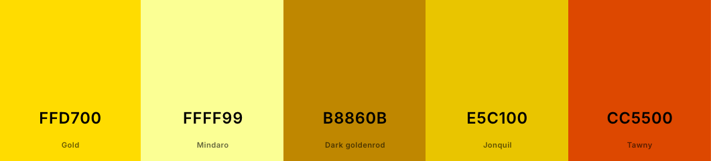
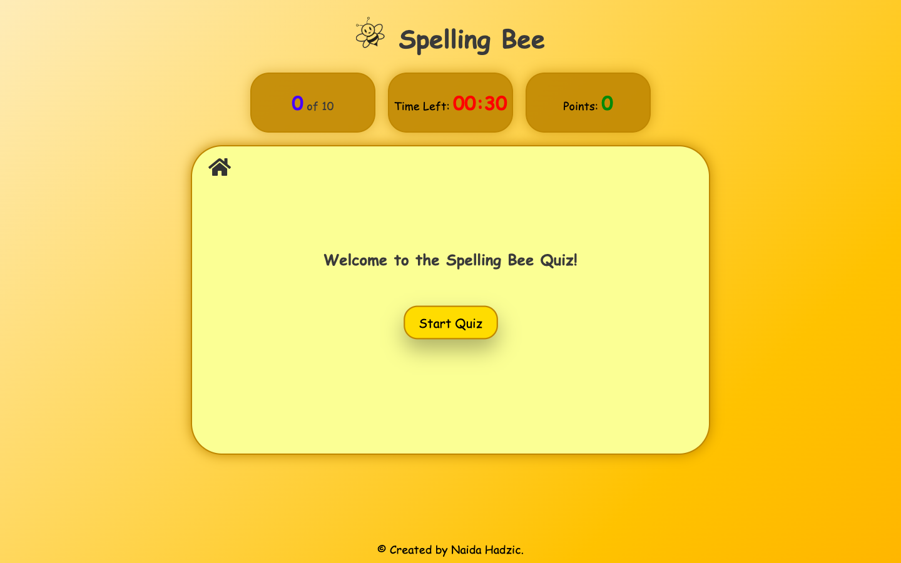
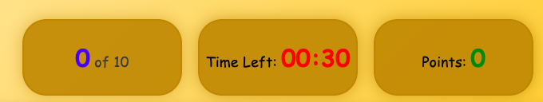
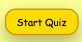

# SPELLING BEE

## Introduction

The **Spelling Bee Quiz** is an interactive spelling game designed to help users practice and improve their spelling skills. It challenges players to spell words correctly within a set time, while also providing features like a "50/50" lifeline and difficulty levels.

# User Stories

## Visitor Goals

- I want to have fun while improving my spelling skills. 
- I want to interact with buttons, answer choices, and lifelines (like 50/50) in an intuitive and easy way.
- I want clear instructions about how to start, how to use features like 50/50, and how to track my progress in the game.
- I would like to know right away if my answers are correct or incorrect. I want immediate feedback on how they're doing, like sound effects for correct or incorrect answers.
- I want to see my score, progress through the quiz, and time remaining.
- I want to choose my difficulty (easy, medium, hard).
- I want the quiz to gradually increase in difficulty.
- I want the game to look good, with attractive design elements that make it visually appealing. 
- I want the quiz to be responsive on all devices, whether I'm playing on a phone, tablet, or desktop.
- I want to start the game easily, with a button to start the quiz right away and easy navigation to switch between different parts of the game.
- I want to see how many questions I answered correctly and view my total score at the end.
- I want the questions to be mixed up and that quiz never starts with the same pattern."

## Site Owner Goals

- I want to provide users with an enjoyable yet challenging way to improve their spelling skills.
- I want to ensure the game is simple, intuitive, and accessible, making it easy for players of all ages to understand and enjoy.
- I want to implement multiple difficulty levels (Easy, Medium, Hard).
- I want to allow users to use a 50/50 lifeline, helping them narrow down their choices.
- I want to keep track of the user’s score and progress throughout the quiz, showing them how many questions they’ve answered correctly and how much time remains.
- I want to introduce a timer that adds a sense of urgency and teaches users to think quickly and efficiently under pressure. 
- At the end of the quiz, I want to provide a certificate with the user’s score to motivate them to play again or improve their performance
- I want to make the game accessible on different devices (desktop, tablet, mobile).
- I want to use sound effects (correct/wrong answers, button clicks).
- I want the questions to be shuffled so that users cannot memorize the order of correct or incorrect answers.

## Target Audience

- **Age Range**: 12–50 years, with specific interests for younger learners, language enthusiasts, casual players, and educators. 

## Design

### Color Scheme

The color scheme was inspired by the colors of bees, honey, and the hive.

- Body Background: linear-gradient(135deg, #fceabb 0%, #f8b500 100%), which stands for honey-themed background color.
- Game Area Background: A soft yellow (#ffff99) with a honey-like golden border and box-shadow (#B8860B, a dark honey color).
- Main Buttons & Interactive Elements: Golden hues like #FFD700 (honey gold) and #e6b800 (darker golden-yellow) for hover effects.
- The text primarily uses a neutral dark gray (#3a3a3a) and black, with some bright color accents like green (#28a745) for correct answers, and red (#dc3545) for wrong ones.
- Timer, Score, Question Number: These elements have bright colors like red (#ff0000), green (#28a745), and blue (#0000ff) to stand out.
- Popup Background: Gradient of deep purple (#3E2A47) and honey yellow (#F9A602), with golden borders (#B8860B).
- Popup Text: Bold black text against a light-colored background with a pop of yellow or red for interactive buttons.
- Submit and Action Buttons: Similar golden yellow tones with a border of dark honey and box-shadow effects to provide a tactile feel.
- Play Again and Instruction buttons have the green background with the white text.

## Fonts

The font used in my stylesheet for various elements is primarily 'Comic Sans MS', 'Trebuchet MS', and cursive. These fonts are used for various components such as the body, buttons, and game elements and they give the site a playful look.

## Wireframes

- Big screens - laptop & desktop
- Medium screens - tablets
- Small screens - mobile

## Features 

- **Difficulty Levels**: The game offers three levels of difficulty: Easy, Medium, and Hard. Players can choose their preferred level at the start of the quiz.
  
- **Timer**: Each question comes with a 30-second countdown timer. If the timer runs out before the user answers, the question will automatically be skipped.

- **50/50 Lifeline**: The "50/50" button can be used once per level to eliminate two incorrect answers, helping users focus on the remaining options.

- **Progress Tracker**: A progress table shows the current question number and the total number of questions, so players can track how far they've gone.

- **Scoreboard**: Players earn points for correct answers. The score is updated dynamically during the game.

- **Certificate**: At the end of the quiz, users receive a certificate with their scores.

### Existing Features

Instead of adding extra pages, modals are utilized to provide a smoother and more intuitive user experience, keeping everything in one place.

- __Welcome page__

  - This is the main landing page. It contains the heading, Start Quiz button, the welcome message, Home Button, the copyright and quiz tables (Progress, Timer, Score).

  -**The Home Button** 
   -The Home button is also present throughout the quiz, allowing the user to return to the beginning of the quiz at any time if they wish.

  

  -**Heading** 
  -I decided to include the heading as well, to improve visual appearance. I used dark latte gray color and a transparent logo image of a bee.

    

  -**Tables** 
  -The quiz features a progress tracker that displays the current and total question numbers to help players monitor their progress, along with a dynamically updated scoreboard where players earn points for correct answers. The tables are disabled on the welcome page.
  

-**Welcome message** 
-Introduces the user to the quiz.

-**Start Quiz Button** 
-The Start Quiz button is used to begin the quiz, transitioning the user from the welcome page to the next modal. It changes the color when hovered over.

-**Copyright** 
-I included the copyright message at the bottom of the page, which remains visible at all times.

- __The landing page image__

  - The landing includes a photograph with text overlay to allow the user to see exactly which location this site would be applicable to. 
  - This section introduces the user to Love Running with an eye catching animation to grab their attention

- __Club Ethos Section__

  - The club ethos section will allow the user to see the benefits of joining the Love Running meetups, as well as the benefits of running overall. 
  - This user will see the value of signing up for the Love Running meetups. This should encourage the user to consider running as their form of exercise. 

- __Meetup Times section__

  - This section will allow the user to see exactly when the meetups will happen, where they will be located and how long the run will be in kilometers. 
  - This section will be updated as these times change to keep the user up to date. 

- __The Footer__ 

  - The footer section includes links to the relevant social media sites for Love Running. The links will open to a new tab to allow easy navigation for the user. 
  - The footer is valuable to the user as it encourages them to keep connected via social media

- __Gallery__

  - The gallery will provide the user with supporting images to see what the meet ups look like. 
  - This section is valuable to the user as they will be able to easily identify the types of events the organisation puts together. 

- __The Sign Up Page__

  - This page will allow the user to get signed up to Love Running to start their running journey with the community. The user will be able specify if they would like to take part in road, trail or both types of running. The user will be asked to submit their full name and email address. 

For some/all of your features, you may choose to reference the specific project files that implement them.

In addition, you may also use this section to discuss plans for additional features to be implemented in the future:

## Features Left to Implement

- **Daily Challanges**- I would like to introduce daily word challenges to keep players engaged.

-**Multiplayer Mode**- I want to add a competitive mode where users can challenge friends or random players in real time.

-**Custom Word Lists**- I would like to let users or teachers upload their own word lists for personalized quizzes.

-**Rewards and Badges**- I would like to gamify the experience by unlocking badges or rewards based on performance.

-**User Accounts & Progress Tracking**- I would like to enable users to create profiles, save their scores, and track progress over time.

## Testing 

### Validator Testing 

- HTML
  - No errors were returned when passing through the official [W3C validator](https://validator.w3.org/nu/#textarea)
- CSS
  - No errors were found when passing through the official [(Jigsaw) validator](https://jigsaw.w3.org/css-validator/#validate_by_input)
  - ava Script
   - No errors where found when passing through the official [(jshint) validator] 
browsers.(https://autoprefixer.github.io/)
- Am I Responsive?
   - Used to test how my website looks and behaves on different screen sizes and devices. 

### Performance 

- Google Lighthouse in Google Chrome Developer Tools was used to test the performance of the website.

### Performing test on various devices

- The website was tested on the following devices:
 - iPhone SE
 - iPhone XR
 - iPhone 12 Pro
 - iPhone 14 Pro Max
 - Pixel 7
 - Samsung Galaxy S8+
 - Samsun Galaxy S20 Ultra
 - iPad Mini
 - Surface Duo
 - Galaxy Z Fold 5
 - Samsun Galaxy A51/71
 - Nest Hub Max
 - galaxy fold

### Browser testing

- The website was tested with Chrome, Mozilla, Safari and Edge browsers on both a Mac computer and a Windows computer.

## Bugs

### Fixed bugs

- **The click sound**  wasn't working consistently across all buttons. I added the method **clickSound.play();**, which plays the sound immediately after the click event is triggered, inside the event listener or function where I wanted to play the click sound. I also added (clickSound.currentTime = 0;), which ensured that the sound starts from the beginning every time.

- I encountered an issue where **the countdown timer** continued running even after the popup for wrong and correct answers appeared. To resolve this, I used (clearInterval(timer);) statement to stop the timer as soon as the popup is triggered. This successfully prevented the timer from continuing in the background.

- I also encountered **Submit button sound issue**, where the click collided with the sounds for correct and incorrect answers.To avoid the conflict I replaced the click sound for the submit button with a bounce and hover effect, creating a more visually engaging interaction instead of the sound.

### Unfixed Bugs

None of them.

## Deployment
 
- The site was deployed to GitHub pages. The steps to deploy are as follows: 
  - In the GitHub repository, navigate to the Settings tab 
  - From the source section drop-down menu, select the Master Branch
  - Once the master branch has been selected, the page will be automatically refreshed with a detailed ribbon display to indicate the successful deployment. 

The live link can be found here - https://code-institute-org.github.io/love-running-2.0/index.html 

### Forking the GitHub Repository

- To fork the repository:

  - Log in (or sign up) to Github.
  - Go to the repository for this project, DavidRC-Projects/Joint-Effort.
  - Click the Fork button in the top right corner.

### How to clone

 - Log in to Github.
 - Go to the repository for this project, DavidRC-Projects/Joint-Effort.
 - click on the Code button above the file list
 - Select HTTPS button to clone with and copy the link shown.
 - Open the terminal in your code editor and navigate to the folder where you want to clone the repository.
 - Type git clone and paste the URL from the clipboard ($ git clone https://github.com/YOUR-USERNAME/YOUR-REPOSITORY)
 - Press Enter

## Technology Used

### Language

HTML, CSS and JavaScript.

### Programs and sites

- VS code
- Github
- Font Awesome
- Coolors site - for making the background and pop-up color
- Slack - for advice and update
- Google Developer Tools
- Favicon - home button icon
- W3Schools - helps with coding in general
- Pixabay- game sound effects
- Body background color was taken from CSS Gradient Generator 
- Color contrast checker - To calculate contrast ratio of text and background.

## Credits 

### Game inspiration

- The game was inspired by **Merriam - Webster Spelling Game**.

## Acknowledgements

-I'm really grateful to my mentor, Dick Vlaanderen, for sharing helpful advice and thoughtful suggestions throughout the project.

-I’d like to thank my husband for his unwavering support, especially for patiently testing the game on his laptop to help me spot and fix errors.